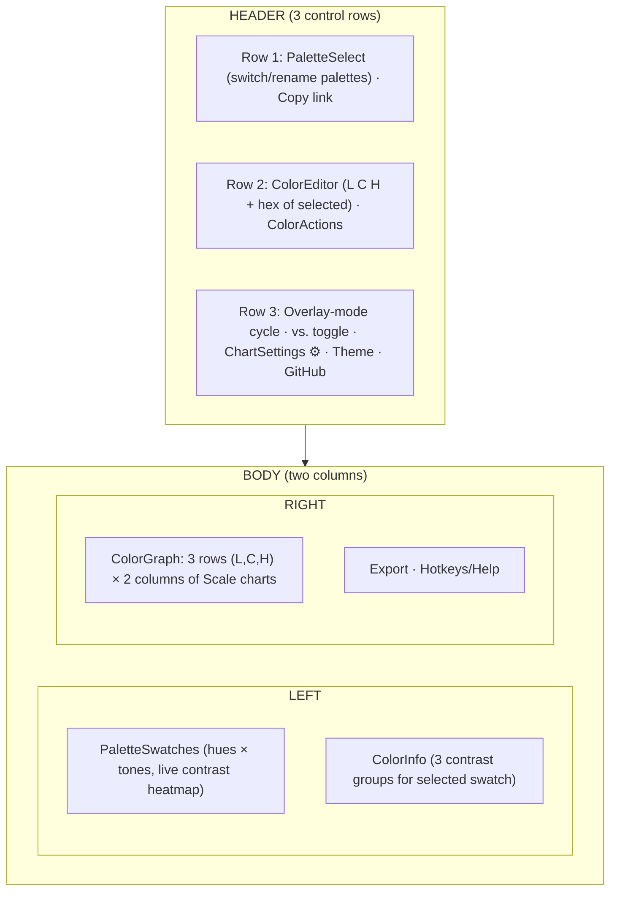

# Huetone UI Research

> Deep observation of the original web Huetone (https://huetone.ardov.me, source: [ardov/huetone](https://github.com/ardov/huetone)) to drive our plugin's UI closer to it before layering in our improvements. Conducted 2026-06-20 by driving the live app with Playwright **and** reading the open-source components (branch ~`edb99b2`). Goal: understand exactly how Huetone looks and _functions_ — its charts, contrast tools, **keyboard model**, **overlay system**, and **settings** — so we can match it and then exceed it.

This is reference material, not a plan. The gap analysis at the end seeds the Phase 8+ UI rework.

**Note on depth:** a first visual pass missed most of the _interaction_ model. Huetone is keyboard-first, the grid is a live contrast heatmap, the charts have a multi-mode overlay system, and there's a settings menu that changes what's rendered. All of that is below, sourced from the actual components.

---

## 1. Overall layout & information architecture

A **single full-screen desktop app**: a 3-row header toolbar, then two main columns.

**IA takeaways:**

- **Everything is on one screen** — no tabs/routes. The selected swatch drives the header editor, both chart columns, and the contrast stack simultaneously.
- The **header is the command center**: the selected color's L/C/H/hex live there (center), with the palette switcher (left) and the chart/overlay/theme controls (right).
- The **charts are the visual hero** (largest area). **Contrast is always visible**, never behind a disclosure.

---

## 2. Header — the command center (`src/components/Header/index.tsx`)

Three `ControlRow`s:

### Row 1 — `PaletteSelect` + Copy link

Switch between multiple saved palettes, rename, create. "Copy link" serializes the whole palette into a shareable URL (LZString-compressed).

### Row 2 — `ColorEditor` (THE top-center editor) + `ColorActions`

`ColorEditor.tsx`: four inputs for the **selected** color — **L, C, H number inputs + a hex input**. Editing any of them calls `lch2color(...)`/`hex2color(...)` and cascades to _everything_ (grid cell, both chart columns, contrast stack). Details:

- Each channel input is a `type="number"` with **per-channel `min/max/step/precision` from `colorSpaceStore.ranges[channel]`** — these differ by color model (see §6 color-model toggle).
- The **hex input turns red when the color is out of sRGB** (`within_sRGB` flag) — a constant gamut-warning at the point of editing.
- Hex input only commits a parsed color; channel inputs clamp to the channel range.

**This is the editor the user emphasized: edits at top-center cascade to the charts and contrast tools.** Our equivalent is the SwatchEditor panel; Huetone keeps it persistently in the header.

### Row 3 — overlay controls + settings

- **Overlay-mode cycle button** (text = current mode): cycles `APCA → WCAG → NONE → DELTA_E` (see §4). Label texts: "APCA contrast" / "WCAG contrast" / "Without overlay" / "Delta E distance".
- **`vs.` toggle** (only when mode ≠ NONE): toggles the reference color between **`selected`** and **`white`**. This sets what the grid/charts measure contrast/distance _against_.
- **`ChartSettings` ⚙ menu** (see §6).
- **Theme toggle** (light/dark) + **GitHub link**.

---

## 3. The palette grid — a live contrast heatmap (`PaletteSwatches.tsx`)

Not just colored cells — **every swatch renders a contrast number on it**, against the overlay reference. CSS grid: `64px [hue label] + repeat(tones, 48px) + 24px`, rows `32px [tone labels] + repeat(hues, 48px) + 24px`.

- **Rows = hues, columns = tones.** Hue labels (left) and tone labels (top) are **inline `InvisibleInput`s — rename in place**.
- **Each swatch is a `<button>`** showing `getCR(color.hex)` = the contrast value (APCA/WCAG/Delta-E per the overlay mode) of that swatch **against `versusColor`** (selected or white), floored to 0.1. So the grid is a **live heatmap of "how does every color contrast against the reference?"** — change the reference or mode and the whole grid's numbers update.
- **Selected swatch:** `scale(1.25)` + bold (900) + rounded corners + raised z-index. Distinct, animated selection.
- **Inline add/remove:** `+` buttons at the end of the tone row and hue column add a tone/hue; `×` buttons (appear on hover) delete a row/column. **Axis editing is built into the grid**, not a separate panel.
- **Hold `B`** → grid renders in **greyscale** (`lch2color([l,0,0])`) — instantly see lightness-only structure (a "squint test").

**vs. ours:** ours shows plain color swatches + a separate `
` axis editor + a separate contrast grid. Huetone fuses them: the grid _is_ the contrast heatmap, and axis editing is inline. The greyscale `B` toggle and the per-cell contrast numbers are features we lack entirely.

---

## 4. The overlay system — the dimension I first missed (`store/overlay.ts`)

The single most important thing my visual pass missed. There is a global **overlay** with two axes:

- **`mode`**: `'APCA' | 'WCAG' | 'NONE' | 'DELTA_E'` (default `APCA`).
- **`versus`**: `'selected'` | a color string (default `'white'`). `versusColorStore` resolves `'selected'` to the selected swatch's hex.

**OBSERVED LIVE** (cycling the header button + reading the grid each time): the overlay's primary effect is on **the grid heatmap** — each cell's number is `contrast[mode](versusColor, cellHex)`:

- **APCA:** grid cells show Lc values (e.g. a hue row vs. white).
- **WCAG:** same cells now show WCAG ratios (observed first row vs. white: `1, 1.3, 1.8, 2.5, 3.8, 6, 9.2, 14.5, 17.7` — ascending as tones darken).
- **NONE:** cells show **no numbers** — pure color swatches — and the **"vs." button disappears**.
- **DELTA_E:** cells show **perceptual distance** (observed vs. white: `1.8, 6.2, 14.8, 22.6, 32.5, 44.7, 57.3, 75.1, 88`).

So one control re-reads the **entire grid** under a chosen metric against a chosen reference. (The charts themselves did **not** visibly change with overlay mode — the charts are the gamut/color map (§5–§6); the overlay metric lives on the grid. My initial source-only guess that it "shades the charts" was not borne out by driving it.)

`DELTA_E` (`deltaEContrast`) = perceptual distance from the reference — useful for spacing a ramp evenly. `NONE` = pure colors.

**vs. ours:** we have APCA + WCAG in a fixed per-swatch display and a separate contrast grid. We have **no Delta-E**, no single global "vs." reference re-reading the whole grid, no mode cycling, and **no contrast numbers on the grid swatches themselves**. This overlay concept is elegant and worth adopting.

---

## 5. The channel charts — the centerpiece (`ColorGraph/`)

Six charts in a **3×2 grid**: **3 rows = L, C, H**; **2 columns = two cross-sections** of the selected swatch:

- **Left column = "this hue across all its tones"** (the selected ramp). e.g. L header values descend `97.4 … 21.2`.
- **Right column = "this tone across all hues"** (the selected column). e.g. L header `60.7, 63.7, 63.4, …` (same tone, different hues).

So editing shows, at once, **how the swatch fits its own ramp** _and_ **how it sits among sibling hues at the same tone** — the key to cross-hue consistency.

### 5.1 Anatomy of one chart (`ColorGraph/index.tsx` → `Scale`)

A layered composite, **not** a pure canvas:

1. **Header row of `<input type="number">`** — one per swatch, **each tinted with that swatch's color** (auto-contrasting text), showing the channel value (precision higher for the selected one). Editing a number sets that channel directly (`setColor` → clamp to `ranges[channel]`).
2. **A `<canvas>`** that paints **only the valid-gamut region**: for each X (a swatch column) and each Y (a channel value) it asks "is `{this channel = Y, other two fixed}` in gamut?" — if yes, paint the resulting color; if no, leave transparent. A **CSS checkerboard background** on the wrapper shows through the transparent (out-of-gamut) zones → the organic grey blobs. `showColors` (settings) toggles real-color vs. a greyed filter.
3. **Draggable knobs = `<input type="range">`**, one per swatch, **rotated −90° (vertical)**, absolutely positioned at each swatch's X over the canvas. The thumb is a ring (bigger/filled for selected). **Dragging the range edits that channel.** Native range = free keyboard + pointer accessibility.

**Critical insight:** the "dots" are **native `<input type="range">`**, not canvas paint — which is why synthetic _canvas_ pointer events do nothing (interaction lives in the DOM range inputs). This matches the `useMove`/native-control approach we already use for our sliders.

### 5.2 Rendering performance (`Chart/Canvas.tsx`, `Chart/RenderStrategy/`)

The gamut region (per-pixel-column gamut test) is expensive, so Huetone uses a **web-worker pool** with a "concurrent spread" strategy, debounced (50ms). Repaints on color/mode change. `OPTIMAL_SPREAD_AREAS_AMOUNT = 100`. Workers are available in our iframe, so this is portable if we need the performance.

### 5.3 Axis mapping

- **X** = swatch index, evenly spaced (`sectionWidth = width / colors.length`).
- **Y** = channel value normalized to `ranges[channel]` `[min, max]`. Default canvas **400×150** per chart.

---

## 6. Settings — what gets shown & how (`Header/ChartSettings.tsx`, `store/chartSettings.ts`)

A ⚙ dropdown with toggles that change rendering:

- **Color model toggle:** `Use OKLch / CIELch color model` (`toggleColorSpace`). Huetone supports **both** okLCH and CIELCH, with **different per-channel `ranges`** (min/max/step/precision) — e.g. the C-channel nudge step is `0.5` in CIELch vs `0.005` in okLCH. The whole app recomputes in the chosen model.
- **`Show/Hide colors on charts`** (`showColors`): paint real colors vs. greyed filter on the gamut canvases.
- **`Show/Hide P3 color space`** (`showP3`): overlay the **Display P3 gamut boundary** on the charts.
- **`Show/Hide Rec. 2020 color space`** (`showRec2020`): overlay the **Rec.2020 gamut boundary**.

**The P3/Rec2020 overlays are a big one for us:** they show how much chroma headroom exists _beyond sRGB_ — directly relevant to our gamut-mapping/P3 story (SPEC §2.7). We currently only ever reason about the single active gamut.

`chartSettingsStore` persists to localStorage.

### 6.1 OBSERVED LIVE — these toggles transform the charts (not minor!)

Driving the live app (toggling the ⚙ menu and screenshotting) revealed that `showColors` + the gamut overlays **fundamentally change the charts' character**, far beyond what the source alone suggests:

- **Default (showColors off):** charts are a **grey gamut silhouette** — abstract organic blobs on a checkerboard. Reads as "where is it valid."
- **showColors ON:** the valid region is painted in **full actual color**. The **L chart** becomes a light→dark gradient of the real colors; the **C chart** a grey→saturated chroma sweep; the **H chart** a **full horizontal rainbow** of every hue at that L/C (vivid). It reads as "what color is here, and is it valid" simultaneously.
- **showP3 ON (with colors):** a **second gamut boundary** appears beyond the sRGB silhouette — the colored region visibly extends further where P3 allows more chroma, with a distinct secondary contour. (Rec.2020 adds a third, even wider.) You can literally _see_ the chroma headroom you'd gain in a wider gamut.

This is one of the most important findings of the live pass: the charts aren't just a gamut mask — with colors+gamut overlays they're a **rich, multi-gamut color-space map**. Our histogram band is nowhere near this. (Screenshots captured this session: grey vs. colored+P3 charts.)

---

## 7. The contrast tools — selected-color panel (`ColorInfo/index.tsx`, `ContrastBadge.tsx`)

Below the grid, a **stack of three contrast groups** for the selected swatch:

- **vs. `tones[0]`** (the ramp's lightest tone) · **vs. `white`** · **vs. `black`**.

Each group:

- A heading `"{hue}-{tone} vs. <input>"` — the **"vs." target is an editable input** (a tone name OR any CSS color), so each comparison is configurable.
- **Three badges:** **APCA(bg, fg)**, **APCA(fg, bg)** (both polarities — APCA is asymmetric), **WCAG**.

Each badge = a **preview chip rendered in the actual color pair** (you _see_ legibility) + a **number + human verdict**, color-coded.

**APCA verdicts** (`getAPCAComment`, magnitude bands):

| Lc   | Verdict              | Color   |
| ---- | -------------------- | ------- |
| ≥ 75 | Best for text        | green   |
| ≈ 69 | "Nice" (easter egg)  | —       |
| ≥ 60 | Ok for text          | green   |
| ≥ 45 | Only large text      | neutral |
| ≥ 30 | Not for reading text | neutral |
| ≥ 15 | Not for any text     | red     |
| < 15 | Fail                 | red     |

**WCAG verdicts** (`getWCAGComment`):

| Ratio | Verdict                    | Color   |
| ----- | -------------------------- | ------- |
| ≥ 7.0 | AAA                        | green   |
| ≥ 4.5 | AA (normal), AAA (large)   | green   |
| ≥ 3.0 | AA (large & UI components) | neutral |
| < 3.0 | Fail                       | red     |

Numbers floored to 0.1. (green ≥ 60 APCA / ≥ 4.5 WCAG; red < 30 / < 3.)

**vs. ours:** our `ContrastDisplay` is _richer on typography_ (full APCA font-lookup → pass/fail per exact size+weight; Huetone uses fixed magnitude bands). But Huetone is better on: **both APCA polarities side by side**, a **configurable "vs." per group**, **preview chips in the real pair** (legibility you can see), **three always-visible references** (lightest/white/black), and **human verdicts** ("Ok for text" reads faster than "Pass · 16px/400"). Our contrast _grid_ (Phase 6) is a separate matrix Huetone doesn't have.

---

## 8. Keyboard model — Huetone is keyboard-first (`KeyPressHandler.tsx`)

This is the interaction layer I most underrated. A global keydown handler (skips real text inputs, but **active on range inputs**):

| Keys                      | Action                                                                                                              |
| ------------------------- | ------------------------------------------------------------------------------------------------------------------- |
| **↑ ↓ ← →**               | **Select** another swatch (move across hue/tone grid)                                                               |
| **Hold L/C/H + ↑/↓**      | **Nudge that channel** of the selected color (L,H by ±0.5; C by ±0.005 okLCH / ±0.5 cielch) — the primary fast-edit |
| **⌘/Ctrl + ↑↓←→**         | **Move** (reorder) the row/column                                                                                   |
| **⌘/Ctrl + Shift + ↑↓←→** | **Duplicate** the row/column                                                                                        |
| **⌘/Ctrl + C**            | Copy selected **hex**                                                                                               |
| **⌘/Ctrl + Shift + C**    | Copy selected **LCH string**                                                                                        |
| **⌘/Ctrl + V**            | **Paste** a color onto the selected swatch                                                                          |
| **Hold B**                | Grid → **greyscale** (lightness-only view)                                                                          |
| **1–9**                   | **Switch palette**                                                                                                  |
| **Esc**                   | Blur the focused input                                                                                              |

The **hold-channel-key + arrow** model means you fly through editing a whole ramp without touching the mouse: arrow to a swatch, hold `L`, tap `↑↑↑` to raise lightness, watching the chart curve and contrast numbers update live. We have per-control keyboard but **no grid-level arrow navigation and no channel-nudge modal** — a significant ergonomics gap.

**OBSERVED LIVE:** dispatched `keydown KeyL` then `ArrowUp` — the selected color's L went **91.43 → 91.93** (exactly +0.5), and the header `ColorEditor` updated. Confirmed the nudge is real and cascades to the header. Separately, editing the header `ColorEditor` L input directly (set 91.43 → 50) recolored the selected grid swatch from `rgb(255,219,209)` to `rgb(123,90,81)`, updated the header hex to `#7b5a51`, repositioned the charts' dot for that tone, and updated the three contrast cards' verdicts — **confirming the top-center editor cascades to grid + charts + contrast** (the behavior the user emphasized).

---

## 9. Other surfaces

- **Export** (`Export.tsx`): Copy JSON tokens, Copy CSS variables, Figma (via a separate plugin). We write Figma Variables natively + DTCG — **ahead**.
- **Help/Hotkeys**: an always-visible legend.
- **Serialization caveat (known):** Huetone persists palettes to **hex** in localStorage, losing okLCH precision on reload — the exact bug our code-syntax/DTCG approach fixes. Not a feature to copy.

---

## 10. Gap analysis — our plugin vs. Huetone

### Where we're already ahead

- **okLCH precision** — lossless via code syntax/DTCG; Huetone loses it to hex.
- **Figma integration** — native Variables; Huetone needs a second plugin.
- **Typography contrast** — full APCA font-lookup (pass/fail per size+weight); Huetone uses fixed bands.
- **Contrast grid** — a contrast.tools-style matrix Huetone lacks.

### The real gaps (priority order)

1. **CHANNEL CHARTS (biggest).** Ours: a 1D histogram band layered behind a slider, current ramp only. Huetone: the full **3×2 chart grid** — two cross-sections (this-ramp + this-tone-across-hues), a **2D valid-gamut silhouette** (per-column gamut test), **draggable knobs _on_ the chart**, and a **tinted value-input header row**. To close: build the dual-column chart, paint the proper gamut silhouette (worker canvas or per-column sampling), put draggable knobs over it, and add the tinted number header.
2. **The OVERLAY system.** One global control (mode: APCA/WCAG/NONE/**DeltaE**, versus: selected/white) that re-reads the **entire grid + charts** against a reference. We have none of this — adopt it. Add **Delta-E** as a metric.
3. **Grid as contrast heatmap.** Show the contrast/distance number **on every swatch**, live against the overlay reference. Plus the **`B` greyscale squint view**. We show plain swatches.
4. **Keyboard-first editing.** Grid arrow-navigation + the **hold-L/C/H + arrow nudge** model + move/duplicate/copy/paste shortcuts. Major ergonomics win.
5. **Settings depth.** **P3 / Rec.2020 gamut overlays** on the charts (headroom beyond sRGB — ties into our P3 story), `showColors` toggle, and (maybe) a **CIELCH/okLCH model toggle**.
6. **Persistent header editor.** Keep the selected color's **L/C/H + hex always editable in a header**, with the hex going red out-of-gamut — rather than only inside a per-swatch panel.
7. **Contrast tool depth.** Both APCA polarities, configurable "vs." per group, **preview chips in the real pair**, three always-visible references, human verdicts — layered on top of our font-lookup richness.
8. **Density / inline editing.** Fuse axis editing into the grid (inline rename, hover +/× add/remove) instead of a separate panel.

### Constraint: we're a ~480px Figma plugin panel, not a 1600px web app

The 3×2 charts won't fit side-by-side. Adaptations to figure out: stack the two chart columns vertically (or tab by channel), make the chart area scrollable, and prioritize a dense single-column flow. This is layout adaptation, not feature cutting. Charts run in the iframe (Chromium) so workers are available.

---

## 11. Source map (Huetone, ~`edb99b2`)

| Concern                          | Files                                                                                                                                                                                                        |
| -------------------------------- | ------------------------------------------------------------------------------------------------------------------------------------------------------------------------------------------------------------ |
| **Charts**                       | `components/ColorGraph/index.tsx` (`Scale`: tinted number header + canvas + range knobs), `ColorGraph/Chart/Canvas.tsx` (worker-rendered gamut canvas + checkerboard), `Chart/RenderStrategy/` (worker pool) |
| **Grid (heatmap + inline edit)** | `components/PaletteSwatches.tsx` (per-cell contrast number, B-greyscale, inline rename, +/× add/remove, selected scale-up)                                                                                   |
| **Header / top editor**          | `components/Header/index.tsx`, `Header/ColorEditor.tsx` (L/C/H/hex, red-when-out-of-gamut), `Header/ChartSettings.tsx`, `Header/PaletteSelect.tsx`, `Header/ColorActions.tsx`                                |
| **Contrast panel**               | `components/ColorInfo/index.tsx` (3 groups vs lightest/white/black, configurable vs), `ColorInfo/ContrastBadge.tsx` (APCA/WCAG verdict thresholds)                                                           |
| **Overlay**                      | `store/overlay.ts` (mode APCA/WCAG/NONE/DELTA_E × versus selected/color; `versusColorStore`)                                                                                                                 |
| **Settings / color model**       | `store/chartSettings.ts` (showColors/showP3/showRec2020), `store/palette` (`colorSpaceStore.ranges[channel]`, `toggleColorSpace` okLCH⟷CIELch)                                                               |
| **Keyboard**                     | `components/KeyPressHandler.tsx` (all hotkeys), `shared/hooks/useKeyPress`                                                                                                                                   |
| **Color math**                   | `shared/color` (`apcaContrast`, `wcagContrast`, `deltaEContrast`, `getMostContrast`, `colorToLchString`)                                                                                                     |

**Reference screenshots** were captured against the live site this session (overview, charts close-up, contrast stack) — regenerate via Playwright as needed; not committed.
