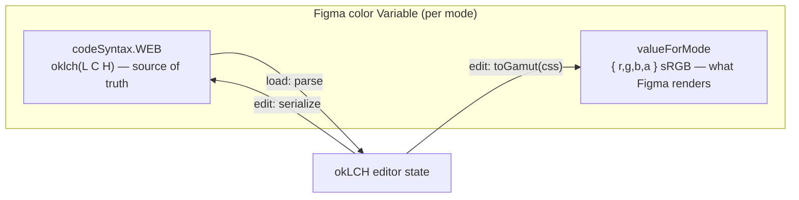
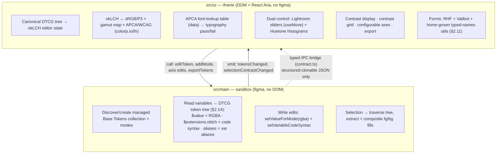

# Figma Huetone — Specification & Plan

> **Status:** Draft v0.3 — research + stack decisions resolved, awaiting review.
> Nothing here is committed to code yet. Sections marked **⚠ OPEN** are decisions
> we still need to make together before the relevant phase begins. (v0.2 folded in
> the stack direction: colorjs.io, React Aria + RHF + Valibot, configurable grid,
> CSS-token export. **v0.3** adopts the **DTCG token format as the canonical
> internal model**, clarifies the **dual slider + histogram** color control, and
> replaces the Ariakit dependency with **home-grown RHF form utilities**.
> **v0.3.1** converts diagrams to Mermaid. **v0.3.2** resolves the P3 gamut
> target — follow the document profile.)
>
> **Naming note:** the working collection name is `Huetone Base` and the plugin is
> codenamed after Huetone, but **this is temporary** — we cannot ship under the
> Huetone name. A real name is TBD and deliberately deferred.

This document is the decision log for porting [Huetone](https://github.com/ardov/huetone)
into a Figma-native plugin. It captures the background research, the motivations,
the concrete goals, and a phased implementation plan grounded in the existing
plugin template's architecture. It is expected to change substantially as we
build; treat it as the living source of intent, with the README as the
human-facing intro and the `.claude/skills/figma-plugin-*` skills as task depth.

---

## 1. Problem & Motivation

Building an accessible color palette today means shuttling values by hand between
several disconnected tools:

- **Huetone** for okLCH ramp authoring with perceptual contrast feedback, but it
  serializes to **hex** — so okLCH precision is lost on every reload.
- **A contrast checker** (e.g. contrast.tools, APCA calculator) to validate that
  a foreground/background pair is legible _at a given font size and weight_ — not
  just as an abstract ratio.
- **Figma** itself, where the palette ultimately lives as **Variables**, entered
  and corrected by hand, with no link back to the perceptual source values.

The author has been doing this loop manually. The goal of this plugin is to
**collapse that loop into one tool that lives where the palette lives** — inside
Figma, editing Figma Variables in place, with the perceptual (okLCH) source of
truth preserved losslessly, and with accessibility validated against real
typography rules rather than a single contrast number.

### What "done right" looks like

1. The plugin UI reads the document's managed **Base Tokens** collection and
   renders it as Huetone's familiar ramp grid (hue groups × tone scale).
2. Editing a swatch (via numeric input or the channel charts) updates the Figma
   Variable **live** — both its rendered RGBA value and its canonical okLCH
   source — so the canvas reflects the change immediately.
3. okLCH precision survives reloads, because we persist it in the Variable's
   **code syntax** field, not just the lossy RGBA value.
4. The user can see, at a glance: APCA (Lc) and WCAG contrast for any pair, the
   **valid okLCH range** per channel for each swatch, the contrast of their
   **current canvas selection**, and a **grid** of which pairings pass for which
   font weight/size.
5. A consumer can build Alias / Scoped / Pattern token layers _on top of_ our
   managed Base Tokens collection without ever needing to hand-edit it.
6. The palette **round-trips out** to a code distribution: the user exports
   CSS-variable color tokens in the shape of [`@saeris/colors`](https://github.com/Saeris/colors)
   and drops them straight into a Tailwind + Shadcn app (the end-to-end lifecycle
   the author already proved by hand: Figma → `@saeris/colors` NPM package →
   downstream app like `anime-search`).

---

## 2. Background Research

### 2.1 The plugin template we're building on

The repo is the author's Figma plugin template. The load-bearing facts (full
depth in the `figma-plugin-architecture` skill and `CLAUDE.md`):

- **Two isolated threads, one message channel.**
  - `src/main/` (sandbox): has `figma` + `__html__`, **no DOM**. QuickJS/ES2020 →
    `dist/code.js`. All Variable reads/writes and node traversal live here.
  - `src/ui/` (iframe): has DOM + React 19, **no `figma`**. → inlined
    `dist/index.html`. All color math, charts, and rendering live here.
- **The typed IPC bridge (`src/ipc/`) is the only extension surface.** We add
  `Procedures` (UI→main request/reply) and `Events` (main→UI push) to
  `contract.ts`; the bridge/transport/signals are generic over it. We never edit
  `transport.ts`/`bridge.ts`. Only **structured-clonable** data crosses — so a
  Variable becomes a plain record (`{ id, name, modeValues, codeSyntax }`), never
  a live node.
- **UI consumes pushed state via `eventSignal` + `useSignal`, async reads via
  `asyncSignal`.** Reactive plumbing already exists and is tested.
- **`documentAccess: "dynamic-page"`** → we must use the **async** `figma.*` API.
- **Build:** `vp run build` (two passes + manifest), `vp check` (0 errors / 0
  warnings is the bar), `vp test`. The contract test in `src/__tests__/` is the
  load-bearing test and must stay meaningful as the contract grows.
- **Theming:** UI styled exclusively with `--figma-color-*` variables; the
  vendored `src/ui/components/` (Button, Input) are the seed set to extend.

### 2.2 Huetone — what we port and what we change

Source: `ardov/huetone` (branch `master`).

| Concern            | Huetone today                                                                                                                                                                   | Our port                                                                                                                                                                                                                                                                                                                                                              |
| ------------------ | ------------------------------------------------------------------------------------------------------------------------------------------------------------------------------- | --------------------------------------------------------------------------------------------------------------------------------------------------------------------------------------------------------------------------------------------------------------------------------------------------------------------------------------------------------------------- |
| **Palette model**  | `Palette = { mode, name, hues[], tones[], colors: TColor[][] }`; `TColor` carries `l,c,h` + `r,g,b,hex` + `within_sRGB/P3/Rec2020` gamut flags. Grid = hues × tones.            | Keep the hues×tones matrix concept, but the _grid_ is projected from a Figma Variable collection: hue groups = variable name prefixes (`red`, `orange`…), tones = scale steps (25–950), and Huetone's "mode" (color space) is fixed to okLCH while a _second_ axis — Figma **modes** (`light`/`dark`/`high-contrast`/colorblind) — replaces Huetone's single palette. |
| **Color math**     | CSS WG conversions (Lea Verou / Chris Lilley) + chroma.js; okLCH↔sRGB, gamut flags drive chart shading.                                                                         | Reuse the same conversion approach via **colorjs.io** (§2.9) for okLCH↔sRGB/P3 and gamut testing. The gamut flag per swatch is what the chart shades and what gates whether a color is representable for Figma in the active profile.                                                                                                                                 |
| **Chart controls** | `src/components/ColorGraph/Chart/` — canvas (web-worker) render of the valid (L,C,H) region for each channel; you drag a point and the other channels' valid ranges re-shade.   | Port the chart rendering to the UI thread, built on React Aria's **`useMove`** for accessible pointer+keyboard dragging (see §2.10). This is the highest-effort UI piece. **⚠ OPEN:** worker pool vs. main-thread canvas inside the Figma iframe (workers add bundling complexity to the single-file UI build). _Lean: main-thread first._                            |
| **Serialization**  | `src/store/palette/converters.ts` exports **hex only** (localStorage, design tokens, CSS vars, LZString permalink). okLCH is recomputed from hex on load → **precision drift**. | **This is the core fix.** Persist canonical `oklch(L C H)` in the Figma Variable's **code syntax**, treat that as source of truth, and derive the RGBA render value from it. No hex round-trip. Conversions via **colorjs.io** (§2.9).                                                                                                                                |

### 2.3 Polychrom — contrast of the current selection

Source: `evilmartians/figma-polychrom` (branch `main`).

- **fg/bg detection is geometric, not semantic**
  (`src/ui/services/figma/find-fg-and-bg-nodes.ts`): flatten the node tree, sort
  by depth + paint (z) order; the **selected** node is foreground, the nearest
  underlying intersecting node is background.
- Fill extraction (`get-node-fills.ts`) + blend/opacity compositing
  (`blend/blend-colors.ts`) run **before** APCA, because the effective background
  may be a stack of semi-transparent fills.
- APCA score + a **conclusion table** (`conclusion.ts`) map Lc → readability
  tier. We adopt this pattern for the "contrast of current selection" readout.
- **Thread placement:** node traversal/intersection/fill extraction must happen
  in the **sandbox** (needs `figma`); the composited fg/bg colors cross the
  bridge to the UI, which runs APCA and renders the verdict.

### 2.4 Radix custom palette generator — opaque + alpha pairing

Source: `radix-ui/website` `components/generate-radix-colors.tsx`.

- For each opaque step it derives a matching **alpha** color by reversing the
  compositing equation `target = bg·(1−α) + fg·α`: solve per-channel α, take the
  max, back-solve the fg channels, and apply per-channel rounding correction
  (browsers composite each channel independently).
- We borrow **the alpha-derivation algorithm**, not the scale-interpolation. Our
  palette is authored in okLCH (not interpolated from Radix reference scales), but
  each opaque Base Token gets a companion **alpha variant** so consumers get the
  same opaque/alpha pairing the author already uses in `@saeris/ui`.
- **Decided:** alpha is always **derived** from the opaque value over a
  **user-defined background** — never hand-tweaked. **Deferred** past v1, but the
  data model and export are designed to accommodate it (generated as separate
  bindable Variables, so they're usable in Figma, and emitted into the export's
  alpha block per §2.13). `@saeris/colors` confirms the background convention:
  light over `#fff`, dark over `#111`.

### 2.5 APCA & the typography discipline

Sources: `Myndex/apca-w3`, APCA Readability Criterion (readtech.org/ARC).

- **APCA is not a ratio.** `Lc = APCAcontrast(sRGBtoY(text), sRGBtoY(bg))`, output
  ≈ **±108**. Sign encodes polarity (dark-on-light positive, light-on-dark
  negative); magnitude is the lightness contrast.
- Key constants (from `apca-w3`): `mainTRC 2.4`; luminance coeffs
  `0.2126729 / 0.7151522 / 0.0721750`; black soft-clamp `blkThrs 0.022`,
  `blkClmp 1.414`; polarity exponents `normBG 0.56 / normTXT 0.57`,
  `revBG 0.65 / revTXT 0.62`; `scale 1.14`; low-contrast `loOffset 0.027`,
  `loClip 0.1`.
- **The font lookup table is the point.** A raw Lc only becomes meaningful against
  font size + weight:
  - **Lc 90** — preferred max; large/bold body, large color areas.
  - **Lc 75** — minimum for body/column text (≈ 24px/300, 18px/400, 16px/500,
    14px/700). Add **+15** to any table value below 75 for body use.
  - **Lc 60** — non-body content text.
  - **Lc 45** — large/headline text (36px/400 or 24px/bold).
  - **Lc 30** — non-text (UI elements, borders).
  - **Lc 15** — incidental / disabled.
- **WCAG 2.x** (flat 4.5:1 normal, 3:1 large/UI) is also computed, for teams that
  still certify against AA. We show **both**, clearly labeled, and never average
  them (per `CLAUDE.md` Rule 7).
- **Implementation:** colorjs.io provides both APCA and WCAG21 (§2.9), so we don't
  separately depend on `apca-w3`. The **font-lookup table** (Lc → min size/weight)
  is _data_, not algorithm — we vendor it as a small typed table in `src/ui`.

### 2.6 contrast.tools — the grid

A matrix of every palette color against every other, each cell showing the
contrast verdict, filterable by the typography context (font size + weight). This
is the visualization that turns "what's the contrast of A on B" into "**which
pairings are valid for 16px medium body text**" at a glance — exactly the
at-a-glance validation goal. We render this in the UI from the palette + the APCA
font lookup; no new sandbox data is needed beyond the palette itself.

### 2.7 Figma Variables — the persistence substrate

Source: developers.figma.com plugin API docs.

- Under `dynamic-page` use the **async** getters: `getLocalVariablesAsync`,
  `getVariableByIdAsync`, `getVariableCollectionByIdAsync`.
- `createVariableCollection(name)`, `collection.addMode(name)` / `modeId` /
  `defaultModeId`; `createVariable(name, collection, "COLOR")`.
- `variable.setValueForMode(modeId, { r, g, b, a })` — **RGBA as 0–1 floats**,
  **sRGB**. `variable.valuesByMode` reads them back.
- `variable.setVariableCodeSyntax(platform, string)` for `WEB | ANDROID | iOS` —
  **this is where we stash canonical `oklch(L C H)`.**
- `createVariableAlias(variable)` for the alias layers consumers build on top.
- No documented hard cap on modes per collection (plan/UI limits aside).

**Persistence model (the central design decision).** Each color Variable carries
two fields per mode — the rendered RGBA and the canonical okLCH:

```
Variable "color/red/500", mode "light":
  valueForMode(light) = { r,g,b,a }            ← sRGB float, gamut-mapped; what Figma renders
  codeSyntax.WEB       = "oklch(0.62 0.21 25)"  ← canonical source of truth
```

On load we read `codeSyntax.WEB`, parse okLCH → authoritative state. On edit we
write **both** fields. The RGBA is _derived_ and **perceptually gamut-mapped**
(colorjs.io `toGamut({ method: "css" })`, binary-search chroma reduction in OKLCH —
not naïve clipping), so the two can intentionally diverge — we preserve intent in
okLCH and render the closest in-gamut color.



> **Note (see §2.14):** the okLCH source of truth is conceptually a DTCG token's
> `$extensions` payload. Code syntax is the _Figma-native carrier_ for it today; if
> Figma's native DTCG export matures to round-trip `$extensions`, that becomes the
> cleaner home. Either way the model is DTCG; this is the storage mechanism.

**Document color profile (confirmed).** `figma.root.documentColorProfile` returns
`"LEGACY" | "SRGB" | "DISPLAY_P3"`. New files default to **sRGB**. Variable color
values are `{ r, g, b, a }` 0–1 floats regardless of profile; the profile governs
how Figma _interprets/renders_ them. So our plan:

- **Gamut target follows the document profile (decided).** Read
  `documentColorProfile` on launch (and on change). When the document is **Display
  P3**, gamut-map against **P3** (more headroom). Otherwise (`SRGB`/`LEGACY`), map
  against **sRGB**. Surface a hint reflecting which is active.
- **Profile changes are safe because okLCH is the source.** Our okLCH in
  `$extensions`/code syntax is never touched by a profile switch — Figma re-maps the
  _rendered_ appearance on its side, and we re-derive `$value` from the preserved
  okLCH against the new active gamut. So switching P3 → sRGB simply tightens the
  target; no data is lost.
- If a color is out of the _active_ gamut, show Huetone's gamut warning on that
  swatch and shade the chart accordingly.
- **⚠ OPEN:** exact UI for the warning + whether to offer a P3-vs-sRGB preview
  toggle independent of the document setting.

### 2.8 Modern CSS color (UI rendering)

The UI iframe is a recent Chromium, so we have a narrow modern target:

- `oklch(L C H / α)` is **Baseline widely available** (since 2023). L 0–1, C 0–~0.4
  (100% = 0.4), H degrees.
- We can render swatches directly in okLCH and let the browser do the work; for the
  _Figma value_ we still down-convert + gamut-map to sRGB ourselves.
- `light-dark()` and `color-scheme` are available but **mode is driven by Figma's
  variable modes, not the OS** — so the UI's own theming uses `--figma-color-*`,
  while the _previewed palette_ renders whichever Figma mode the user is editing.

### 2.9 colorjs.io — the color engine

We use [`colorjs.io`](https://colorjs.io) — the most rigorously researched
color-space library available (Lea Verou / Chris Lilley, the same lineage as the
CSS WG functions Huetone already vendors). It gives us, in one dependency, every
piece of color math the plugin needs:

- **Conversions:** okLCH ↔ sRGB ↔ Display P3 (`to("oklch")`, `to("srgb")`,
  `to("p3")`).
- **Gamut:** `inGamut("srgb" | "p3")` for the per-swatch flag/warning;
  `toGamut({ method: "css" })` for **perceptual** mapping (binary-search chroma
  reduction in OKLCH) — the right default, not clipping.
- **Contrast:** built-in **APCA** and **WCAG21** algorithms, so we don't separately
  vendor `apca-w3` unless we need the font-lookup table specifically (which is data,
  not algorithm — see §2.5).
- **Bundle:** the **procedural `colorjs.io/fn` API is tree-shakeable**; we import
  only `to`, `inGamut`, `toGamut`, and the contrast fns to keep the single-file UI
  bundle small. All of this is pure math → lives in the **UI thread**.

This supersedes the v0.1 "culori vs. CSS-WG" open question — **decided: colorjs.io.**

### 2.10 React Aria — the control layer (and the okLCH constraint)

The UI is built on **React Aria** (unstyled, accessible primitives), styled to match
Figma and organized with Adobe-Lightroom-like utility/density.

**Critical constraint discovered in research:** React Aria's `Color` object and
`parseColor` support only **rgb / hsl / hsb / hex — not okLCH/lch**. So we do **not**
drive the high-level `ColorSlider` / `ColorArea` / `ColorWheel` with our okLCH state.
We build our own, holding okLCH state ourselves while inheriting React Aria's
accessibility primitives.

**Two complementary controls — not one.** The author's reference is desktop Adobe
Lightroom's **Color Mixer** (the per-channel Hue / Saturation / Luminance sliders,
each with a precise editable number input — _not_ Lightroom Classic or Web). We pair
that with Huetone's histograms; they do different jobs and we keep both:

| Control                                    | Built on                                                                                                                                               | Job                                                                                                                                                                            |
| ------------------------------------------ | ------------------------------------------------------------------------------------------------------------------------------------------------------ | ------------------------------------------------------------------------------------------------------------------------------------------------------------------------------ |
| **Per-channel sliders** (Lightroom-style)  | React Aria **`useMove`** (the accessible pointer+keyboard drag primitive `useColorSlider` itself uses) + a paired **`useNumberField`** for exact entry | **Precision** — adjust L, C, or H of one swatch to an exact value.                                                                                                             |
| **Per-channel histograms** (Huetone-style) | canvas (see §2.4 chart row)                                                                                                                            | **Context** — visualize the **valid gamut range** for the channel _and_ show how this swatch relates to its **sibling values across the ramp** (the whole row/column at once). |

So a swatch editor shows: the histogram (where am I in the valid range, relative to
my siblings?) above/beside the slider+number trio (nudge me to an exact value). We
use **stock** React Aria color components only where their native model fits — a hex
`ColorField` for paste-in, `ColorSwatch` for static previews.

This closes the "which color components" question and explains why neither a stock
`ColorArea` nor a single slider type is sufficient.

### 2.11 Form architecture — RHF + Valibot, composed Ariakit-style

Form-shaped UI (swatch editors, grid axis config, export options) needs both
robustness and composition ergonomics. We get them from **RHF + Valibot** with a
**home-grown context layer** — **Ariakit is a DX reference, not a dependency.**

- **State + validation (the engine):** **React Hook Form** for state/subscriptions,
  **Valibot** schemas for validation and **type inference**, wired via
  `@hookform/resolvers` (`valibotResolver`). The **Valibot schema's output type is
  the single source of truth** for the form's value shape (e.g. an okLCH triple with
  channel bounds, a grid-axis config).
- **Composition (the ergonomics we port from Ariakit):** a context `Form` provider
  plus field components (`Field`, `Label`, `Error`, and an abstract `Control` that
  does _not_ assume native `value`/`onChange`, for wrapping our `useMove`-based
  okLCH sliders). Components attach to form state by a **`name` prop** rather than
  prop-drilling `value`/`onChange`. Internally `Control` wraps RHF's
  `useController`; field-scoped reads wrap `useWatch`.
- **The load-bearing DX detail — a typed `names` proxy.** Ariakit exposes
  `form.names` (a proxy where `form.names.season` _is_ the string `"season"` but is
  **typed** to that field) and `form.useValue(form.names.season)`. We reproduce this
  over RHF, **derived from the Valibot output type**, so:
  - `name={form.names.swatch.l}` is **type-checked** — a wrong/renamed path is a
    compile error, not a silently detached field (the failure mode of bare string
    `name="..."` props).
  - VSCode **rename-symbol** on a schema key cascades to every `name=` reference.

  The author uses this exact pattern (the Ariakit version) in
  [`Saeris/anime-search`](<https://github.com/Saeris/anime-search/blob/main/src/app/(search)/page.tsx>)
  — that's the **target DX**, but built on RHF here.

- **⚠ This is a genuine R&D spike, not a one-shot.** A recursive typed-path proxy
  that matches Valibot's inferred output (nested objects, arrays) and wires cleanly
  to RHF's `useController`/`useWatch` will take iteration to get right. We isolate it
  as `src/ui/form/` utilities with their own unit/type tests before building real
  forms on top.

### 2.12 The grid is user-configurable (Harmonizer-style)

Both Huetone and [Harmonizer](https://github.com/evilmartians/harmonizer) treat the
palette grid's axes as **user data**, and so do we:

- **Y axis = color names** → Figma variable **groups** (the `red` / `orange` / …
  name prefixes). **X axis = scale steps** → token **names** (`25 … 950`).
- The user can **add / remove / reorder** rows and columns and rename them, with UX
  drawn from Figma's [auto-layout grid flow](https://help.figma.com/hc/en-us/articles/31289469907863)
  (inline rename, drag-reorder) and Lightroom-like panel organization.
- We **seed** a Tailwind/Radix-style default scale (e.g. `50,100…900,950`) so a
  fresh palette **maps directly onto Shadcn/Tailwind** out of the box.
- The plugin therefore owns a small **palette-config model** — ordered group names,
  ordered scale names, the set of modes — that _projects onto_ Figma variable
  names + modes. Renaming a column renames the corresponding variables; reordering
  is metadata. **⚠ OPEN:** where this config lives (plugin data on the collection
  vs. derived purely from variable names) — ties into open question §6.5.

### 2.13 Export workflow — match `@saeris/colors`

The proven end-to-end lifecycle is **Figma → CSS tokens → NPM package → app**. Our
plugin owns the first hop; the export must emit the _shape_
[`@saeris/colors`](https://github.com/Saeris/colors)'s `src/generate.ts` produces,
so it drops straight into a Tailwind + Shadcn project:

- One file per color (or one combined file), `:root` custom properties.
- Opaque: `--{name}-{step}: <value>;` Alpha: `--{name}-a{step}: <value>;`
- Alpha values as `oklch(...)`, with a Display-P3 upgrade inside
  `@supports (color: color(display-p3 …)) { @media (color-gamut: p3) { … } }`.
- Light/dark via a `.dark` selector block; alpha blends the fg over `#fff` (light)
  / `#111` (dark) — see §2.4 / §6.3.

This makes the export a first-class v1 feature, not an afterthought, and reuses the
alpha-derivation math from §2.4 when that phase lands.

### 2.14 DTCG — the canonical internal model

The plugin's **single source of truth is a [DTCG](https://www.designtokens.org/tr/drafts/format/)
(Design Tokens Community Group) token tree**, not a bespoke `PaletteSnapshot`. Every
other representation — Figma Variables, the editor UI state, and all export targets —
is a **projection of, or transform from, this tree.** This is the "good internal
format → easy exports" the author predicted.

Why DTCG specifically:

- **It already solves precision.** The DTCG `color` type's canonical value is
  `{ "colorSpace": "srgb" | "display-p3", "components": number[], "alpha"?, "hex"? }`
  — **continuous channel values, not hex-only.** That's the structural fix for
  Huetone's lossy hex round-trip, standardized.
- **okLCH lives in `$extensions`.** okLCH isn't yet a first-class DTCG `colorSpace`
  (the spec's color spaces are RGB-family). So `$value` holds the DTCG `srgb`/`p3`
  representation that Figma and other tools understand, and the **canonical okLCH
  triple lives in `$extensions["io.saeris.huetone".oklch]`** (reverse-domain key;
  the spec _requires_ tools to preserve extension data they don't understand). We
  keep the perceptual source **and** stay interoperable.
- **Aliases map 1:1 to Figma.** DTCG references (`{group.token}` curly-brace syntax)
  correspond directly to Figma variable aliases — which validates the author's
  layered vision end to end: our **Base Tokens** are concrete DTCG `color` tokens;
  consumers' **Alias / Scoped / Pattern** layers are DTCG references over them.
- **Figma is moving to native DTCG export.** Aligning our model to DTCG means we
  _ride the emerging standard_ rather than inventing a private one, and it future-
  proofs interop with Style Dictionary, Tokens Studio, etc.

**Where things sit:**

| Layer               | Representation                                                                                                                       |
| ------------------- | ------------------------------------------------------------------------------------------------------------------------------------ |
| Canonical model     | DTCG token tree: groups (color names) → tokens (scale steps), `$type: "color"`, `$value` = DTCG color, `$extensions….oklch` = source |
| Figma (persistence) | Variables: `$value`→ gamut-mapped RGBA `valueForMode`; `$extensions.oklch`→ code syntax (§2.7); aliases→ variable aliases            |
| Editor (UI state)   | okLCH read from `$extensions`; RHF/Valibot forms validate edits back into the tree                                                   |
| Export              | Transforms of the tree → `@saeris/colors` CSS (§2.13), Tailwind/Shadcn, Style Dictionary, raw DTCG JSON                              |

**⚠ OPEN** (refine while building): the exact `$extensions` key/shape; whether the
grid-axis config (§2.12) lives in a group-level `$extensions` block; how much of
DTCG we model in v1 vs. grow into (we only need `color` + groups + aliases now).

---

## 3. Goals & Non-Goals

### Goals (v1)

- Read/render a managed **Base Tokens** color collection as a Huetone-style
  hue-group × tone grid, across Figma **modes**.
- Live, two-way editing of swatches → Figma Variables, with okLCH persisted in code
  syntax (lossless round-trip).
- Per-channel **okLCH valid-range charts** (the Huetone editing experience).
- **APCA (Lc) + WCAG** contrast for any pair, with the **font lookup** turning Lc
  into pass/fail per weight+size.
- **Contrast of current selection** (Polychrom-style) in the contrast display.
- **Contrast grid** (contrast.tools-style) filterable by typography context.
- **User-configurable grid axes** (add/remove/reorder/rename groups and scales),
  seeded with a Tailwind/Radix-style default (§2.12).
- **CSS-token export** matching the `@saeris/colors` shape (§2.13).

### Deferred (post-v1, but designed for)

- **Alpha variant** generation paired to each opaque Base Token (Radix approach,
  §2.4). The screenshot's opaque+alpha grid is the eventual target; alpha is always
  _derived_ from the opaque values over a user-defined background — never
  hand-tweaked. We design the model to accommodate it but don't build it in v1.

### Non-Goals (v1)

- Generating the full Alias / Scoped / Pattern token layers — we only _enable_
  consumers to build them on our Base Tokens (we don't author them).
- The disciplined multi-collection system from `@saeris/ui` end-to-end — that's
  context for _how values get used_, not v1 scope.
- Importing arbitrary external palettes / Huetone permalinks (possible later).
- Publishing automation beyond what the template's CI already does.

---

## 4. Architecture & Thread Placement



### Proposed contract additions (illustrative — names to be finalized)

The bridge payloads are **DTCG-shaped** (§2.14): a `TokenTree` is the DTCG color
group tree (structured-clonable plain JSON — DTCG _is_ JSON, so it crosses the
bridge as-is).

```ts
// Procedures (UI calls, main handles)
ensurePaletteCollection: (input: { name: string }) => { collectionId: string };
readTokens:    () => TokenTree;                       // DTCG color tree + groups + aliases
getColorProfile: () => "LEGACY" | "SRGB" | "DISPLAY_P3";
editToken:     (input: { path: string; modeId: string;
                         oklch: [number, number, number]; alpha?: number }) => void;
addMode:       (input: { name: string }) => { modeId: string };
// Grid axis edits (§2.12) — project onto DTCG groups/tokens → Figma variable names
addGroup / removeGroup / renameGroup / reorderGroups: (…) => void;
addScale / removeScale / renameScale / reorderScales: (…) => void;
exportTokens:  (input: { format: "dtcg" | "css-saeris" | "tailwind";
                         background?: { light: string; dark: string } })
                 => { files: { name: string; contents: string }[] };  // §2.13 (transforms of TokenTree)
getSelectionContrast:  () => SelectionContrast | null;
// Deferred: generateAlphaVariants (§2.4) — designed for, not in v1.

// Events (main emits, UI consumes via eventSignal)
tokensChanged:             TokenTree;
selectionContrastChanged:  SelectionContrast | null;
```

`TokenTree` and `SelectionContrast` are plain, structured-clonable records.
Per `CLAUDE.md`, every addition here gets coverage in the contract test.

---

## 5. Phased Implementation Plan

Each phase ends green on `vp check` (0/0) + `vp test` + `vp run build`, and is
independently reviewable.

- **Phase 0 — Foundations.** Rebrand the template (manifest, package; working name
  only). Add deps: **colorjs.io** (confirm not age-gated), **React Aria**, **RHF**,
  **Valibot** + resolver. Establish (a) the okLCH ↔ sRGB/P3 + gamut module over
  `colorjs.io/fn` and (b) the **DTCG `TokenTree` model + Valibot schema** in
  `src/ui`, both with unit tests (round-trip, gamut-map, DTCG↔okLCH `$extensions`).
  _No Figma I/O yet._

- **Phase 0.5 — Form utilities spike (§2.11).** Build and test the home-grown RHF
  utilities: context `Form`, field `Control`, and the **typed `names` proxy derived
  from a Valibot schema**. Isolated in `src/ui/form/` with type-level tests. Flagged
  R&D — gate before building real forms on it. _(Can run parallel to Phase 1.)_

- **Phase 1 — Persistence spine.** Contract + sandbox handlers to discover/create
  the Base Tokens collection, read `documentColorProfile`, read variables into a
  **DTCG `TokenTree`**, and round-trip a single token edit (RGBA `$value` + okLCH
  `$extensions` via code syntax). Prove **lossless okLCH** with a test. De-risks the
  central decision before rich UI.

- **Phase 2 — Ramp grid + numeric editing.** Render the group × scale grid for the
  active mode; edit a token by typed okLCH values (Phase-0.5 form utils); live update
  to Figma. Mode switching. Per-swatch gamut warning.

- **Phase 3 — Configurable axes.** Add/remove/reorder/rename groups and scales
  (Figma-grid-flow UX), seeded with the Tailwind/Radix default scale; project edits
  onto DTCG groups → Figma variable names. (Can land alongside or just after Phase 2.)

- **Phase 4 — Dual color control.** Lightroom-style per-channel **sliders**
  (`useMove` + `useNumberField`) **and** Huetone per-channel **histograms** (valid
  range + sibling-ramp context), per §2.10. (Highest UI effort; decide worker vs.
  main-thread render for the histograms — _lean main-thread_.)

- **Phase 5 — Contrast engine + display.** APCA (Lc) + WCAG (colorjs.io) + the APCA
  **font-lookup table**; contrast display; **selection contrast** (sandbox
  traversal + blend compositing → UI verdict, Polychrom-style).

- **Phase 6 — Contrast grid.** contrast.tools-style matrix, filterable by font
  size/weight, from the palette + font lookup.

- **Phase 7 — Export transforms.** Emit from the canonical `TokenTree`: raw **DTCG
  JSON** + the **`@saeris/colors` CSS** shape (§2.13) for Tailwind/Shadcn. (Opaque
  only in v1; alpha block when the deferred alpha phase lands.)

- **Phase 8 — Polish & ship.** Empty states, errors, performance on large palettes,
  manifest/publish prep per `figma-plugin-publishing`. **Real name** chosen here.

- **Deferred — Alpha variants.** Radix-style derivation (§2.4) paired to each opaque
  token over a user-defined background; generated as bindable Variables and added to
  the export's alpha block.

---

## 6. Open & Resolved Questions

### Resolved (through v0.3)

- **Canonical model** → **DTCG token tree** (§2.14); Figma/UI/exports all project
  from it. okLCH source in `$extensions`; aliases ↔ Figma variable aliases.
- **Color library** → **colorjs.io** (`/fn` tree-shakeable), supersedes culori.
- **Contrast** → colorjs.io's APCA + WCAG21; APCA font-lookup as bundled data.
- **UI controls** → React Aria. **Two complementary controls:** Lightroom-style
  per-channel sliders (on `useMove` + `useNumberField`, since React Aria's `Color`
  can't carry okLCH) **and** Huetone per-channel histograms (valid range + sibling
  ramp). Keep both (§2.10).
- **Forms** → RHF + Valibot, **home-grown** context utils + typed `names` proxy;
  **Ariakit is a reference, not a dependency** (§2.11).
- **Grid axes** → user-configurable (groups × scales), seeded Tailwind/Radix.
- **Alpha** → derived-only, deferred past v1, designed-for.
- **Out-of-gamut** → perceptual `toGamut({method:"css"})`, preserve okLCH intent,
  show warning.
- **Gamut detection + target** → `figma.root.documentColorProfile`; map to **P3
  when the document allows it**, else sRGB. okLCH source is untouched by a profile
  switch, so the target can follow the profile live (re-derive `$value`).
- **Export scope** → deferred; with DTCG as truth, targets are just transforms — easy
  to add late. v1 emits raw DTCG JSON + `@saeris/colors` CSS.

### Still open (decide while building / iterate)

1. **Form-utils typed-`names` proxy** (Phase 0.5): the recursive proxy ↔ Valibot
   output-type wiring is genuine R&D; budget iteration before forms depend on it.
2. **`$extensions` shape** (Phase 0/1): exact reverse-domain key + okLCH payload
   shape; whether grid-axis config lives in a group-level `$extensions` block.
3. **Histogram rendering** (Phase 4): worker pool vs. main-thread canvas in the
   single-file UI build. _Lean: main-thread first._
4. **Out-of-gamut UI** (Phase 2+): exact warning treatment; optional P3-vs-sRGB
   preview toggle independent of the document profile.
5. **Palette identity / config storage** (Phase 1/3): plugin data on the collection
   vs. derive purely from DTCG group/variable names + order. _Lean: plugin-data
   marker for identity + config, names as the human-facing projection._
6. **Real product name** (Phase 8): cannot ship as "Huetone". Deferred by choice.

---

## 7. References

- Huetone — https://github.com/ardov/huetone
- Polychrom — https://github.com/evilmartians/figma-polychrom
- Radix color gen — https://github.com/radix-ui/website/blob/193594859f9847770e7defe04dc579559dd4b343/components/generate-radix-colors.tsx
- contrast.tools — https://contrast.tools/
- APCA — https://github.com/Myndex/apca-w3 · https://www.readtech.org/ARC/
- Figma Variables API — https://developers.figma.com/docs/plugins/api/figma-variables/
- Figma DocumentNode (color profile) — https://developers.figma.com/docs/plugins/api/DocumentNode/
- CSS `oklch()` — https://developer.mozilla.org/en-US/docs/Web/CSS/color_value/oklch
- colorjs.io — https://colorjs.io (gamut mapping: https://colorjs.io/docs/gamut-mapping)
- DTCG token format — https://www.designtokens.org/tr/drafts/format/
- React Aria color + `useMove` — https://react-aria.adobe.com/Color · https://react-aria.adobe.com/useMove
- Adobe Lightroom Color Mixer (control reference, desktop) — slider + number per channel
- Ariakit Form (DX reference, not a dep) — https://ariakit.org/components/form
- Anime Search form (target `form.names` DX) — https://github.com/Saeris/anime-search/blob/main/src/app/(search)/page.tsx
- React Hook Form + Valibot — https://react-hook-form.com · https://valibot.dev
- Harmonizer — https://github.com/evilmartians/harmonizer
- `@saeris/colors` (export target) — https://github.com/Saeris/colors
- `@saeris/ui` token architecture — https://www.figma.com/design/FafgXG0tR6ahMUYqS85hyv/-saeris-ui
- Author's multi-collection token architecture — https://www.tldraw.com/f/J95uMg4ql5CzfiyIYU9ts

```

```
